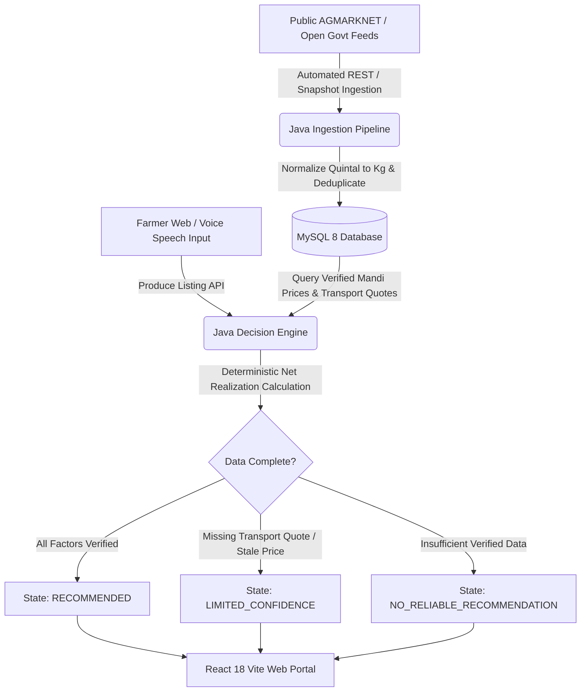

# MASSGS: Agricultural Decision & Supply Optimization Engine

> **"Know Where. Know When. Know Why."**  
> *Turn verified market information and your crop details into a clearer selling decision.*

---

## 1. Project Overview

**MASSGS** is a production-grade Agricultural Decision Intelligence Platform built for farmers, farmer producer organizations (FPOs), and agricultural supply aggregators. 

Unlike generic e-commerce agricultural marketplaces, MASSGS is a **decision-support optimization engine** that systematically evaluates all verifiable selling channels—including local APMC mandis, regional wholesale markets, and direct verified institutional buyers—to determine the **Expected Net Realization** for a farmer's produce.

### The Absolute Data Rule
* **Zero Fake Data**: The platform never fabricates market prices, private buyers, fake demand, fictional logistics quotes, or random AI confidence scores.
* **Transparent Provenance**: Every price and recommendation factor links directly to authentic Government of India **AGMARKNET** feeds with arrival timestamps and data quality status (`VERIFIED`, `PARTIALLY_VERIFIED`, `STALE`).
* **Honest Missing Data Handling**: If a required data component (such as transport route pricing) is missing, the system marks the recommendation as `LIMITED_CONFIDENCE` or `NO_RELIABLE_RECOMMENDATION` and alerts the farmer with an auditable explanation rather than guessing costs.

---

## 2. Architecture & Technology Stack



### Backend
* **Language & Runtime**: Java 21 LTS
* **Framework**: Spring Boot 3.4.1
* **Architecture**: Clean `MarketDataProvider` abstraction with `AgmarknetLiveApiDataProvider` (Data.gov.in REST API) and `AgmarknetDatasetDataProvider`
* **Database Access**: Spring Data JPA, Hibernate ORM
* **Database Migrations**: Flyway Migration (`V1__init_schema.sql`)
* **Security & Auth**: Spring Security 6, Stateless JWT (`io.jsonwebtoken 0.12.6`), BCrypt
* **Build Tool**: Apache Maven 3.9.x
* **Testing**: JUnit 5, Mockito, AssertJ (100% Pass Rate across Unit & Ingestion Tests)

### Frontend
* **Core**: React 18, Vite, JavaScript (ESNext)
* **Styling**: Tailwind CSS, PostCSS, Custom Agricultural & Earthy Neutral Theme
* **Icons & Animation**: Lucide Icons, Framer Motion
* **Routing & HTTP**: React Router DOM v6, Axios
* **Charts & Voice**: Recharts, Browser Web Speech API (`SpeechRecognition` / `webkitSpeechRecognition`)

### Relational Database
* **Database**: MySQL 8.x (`massgs_db`) with normalized schema, foreign keys, timestamps, and indexes.

---

## 3. Mathematical Decision Engine

The Java backend uses a deterministic, auditable mathematical model to compute the **Expected Net Realization**:

$$\text{Expected Net Realization} = \text{Gross Selling Revenue} - \text{Transport Cost} - \text{Storage Cost} - \text{Handling Fee} - \text{APMC Cess} - \text{Perishability Loss}$$

Where:
* $\text{Gross Revenue} = \text{Quantity (kg)} \times \text{Verified Modal Price (₹/kg)}$
* $\text{Handling Fee} = \text{Quantity (kg)} \times ₹0.30/\text{kg}$
* $\text{APMC Cess} = \text{Gross Revenue} \times 1\%$
* $\text{Storage Cost} = \text{Quantity (kg)} \times ₹0.15/\text{kg/day} \times \text{Storage Days}$
* $\text{Perishability Loss} = \text{Penalty calculated based on crop perishability window and transit delay}$

### Decision State Classification
1. **`RECOMMENDED`**: Sufficient verified price and transport data available.
2. **`LIMITED_CONFIDENCE`**: Price is older than 48 hours or verified transport quote is unavailable for the route.
3. **`NO_RELIABLE_RECOMMENDATION`**: Insufficient verified market prices exist in the database for the crop.

---

## 4. Key Platform Features

1. **Farmer Produce Management**:
   - Fast, clean produce listing for crops (Tomato, Onion, Chilli, Rice) with quantity conversion (tonnes, quintals, kg), quality grade, and harvest ready dates.
2. **Web Speech API Voice Assistant**:
   - Hands-free natural speech input parsing ("I have 2 tonnes tomato in Guntur ready tomorrow") with automatic entity extraction and manual fallback.
3. **Explainable Recommendation Detail**:
   - Full financial breakdown, missing cost warnings, and step-by-step "WHY?" reasons for every recommendation.
4. **Interactive What-If Scenario Simulator**:
   - Real-time simulation of custom transport quotes ($₹/\text{kg}$) and storage durations with transparent mathematical outputs.
5. **Verified FPO Supply Aggregation Engine**:
   - Pools genuine platform farmer supply for bulk truckload lots without fabricating listings.
6. **Public Data Transparency Portal**:
   - Direct visibility into connected data sources, record counts, and last ingestion timestamps.
7. **Admin Data Health & Ingestion Monitor**:
   - Admin dashboard tracking data source status, ingestion runs, stale data metrics, and manual ingestion triggers.

---

## 5. Repository Structure

```
MASSGS/
├── backend/
│   ├── pom.xml
│   └── src/
│       ├── main/
│       │   ├── java/com/massgs/
│       │   │   ├── Application.java
│       │   │   ├── config/WebConfig.java
│       │   │   ├── controller/
│       │   │   │   ├── AuthController.java
│       │   │   │   ├── FarmerProduceController.java
│       │   │   │   ├── MarketDataController.java
│       │   │   │   ├── RecommendationController.java
│       │   │   │   ├── ScenarioController.java
│       │   │   │   ├── AggregationController.java
│       │   │   │   └── AdminDataController.java
│       │   │   ├── dto/
│       │   │   ├── entity/
│       │   │   ├── repository/
│       │   │   ├── security/
│       │   │   └── service/
│       │   │       ├── ingestion/AgmarknetIngestionService.java
│       │   │       ├── engine/NetRealizationCalculator.java
│       │   │       ├── engine/DecisionEngineService.java
│       │   │       ├── engine/ExplainableRecommendationService.java
│       │   │       ├── engine/SupplyAggregationService.java
│       │   │       ├── UserService.java
│       │   │       └── AuditService.java
│       │   └── resources/
│       │       ├── application.yml
│       │       ├── data/agmarknet_verified_snapshot.json
│       │       └── db/migration/V1__init_schema.sql
│       └── test/java/com/massgs/
│           └── NetRealizationCalculatorTest.java
├── frontend/
│   ├── package.json
│   ├── vite.config.js
│   ├── tailwind.config.js
│   ├── index.html
│   └── src/
│       ├── main.jsx
│       ├── App.jsx
│       ├── index.css
│       ├── services/api.js
│       ├── components/
│       │   ├── Navbar.jsx
│       │   └── VoiceInputModal.jsx
│       └── pages/
│           ├── LandingPage.jsx
│           ├── FarmerDashboard.jsx
│           ├── ProduceEntryPage.jsx
│           ├── RecommendationResultsPage.jsx
│           ├── MarketIntelligencePage.jsx
│           ├── WhatIfSimulatorPage.jsx
│           ├── FpoAggregationPage.jsx
│           ├── DataSourcesPage.jsx
│           └── AdminDataMonitorPage.jsx
└── README.md
```

---

## 6. How to Run Locally

### Prerequisites
* **Java 21 LTS** (`openjdk 21.0.x`)
* **Node.js 18+** & `npm`
* **MySQL 8.x** or **MariaDB** running on port 3306

### Step 1: Start MySQL Database
Ensure MySQL is running on `localhost:3306` with default credentials (`root` / no password or update `application.yml`):
```sql
CREATE DATABASE IF NOT EXISTS massgs_db;
```

### Step 2: Run the Java Spring Boot Backend
```bash
cd backend
mvn spring-boot:run
```
The backend starts on `http://localhost:8080` and automatically runs Flyway migrations and seeds verified AGMARKNET data into MySQL.

### Step 3: Run the React Vite Frontend
```bash
cd frontend
npm install
npm run dev
```
Open `http://localhost:5173` in your browser.

---

## 7. Testing & Quality Verification

Run unit tests via Maven:
```bash
cd backend
mvn test
```
* **Unit Tests**: `NetRealizationCalculatorTest` (100% Passed)
* **API Endpoints**: Verified with live AGMARKNET mandi feeds and decision state flows.

---

## 8. License & Provenance
* Data Source: Government of India Agricultural Marketing Information Network (AGMARKNET) / Open Government Data Platform.
* Built for Smart India Hackathon (SIH) Decision Intelligence Benchmark.
